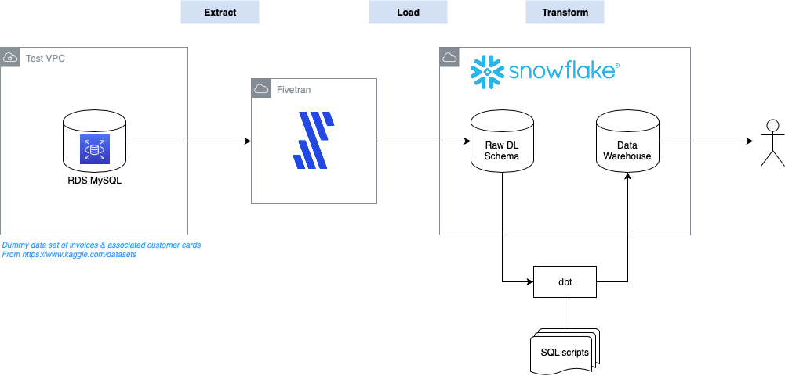

# Hacknight for Snowflake/Fivetran and dbt

## Intro

This repo was produced as part of a hacknight looking at building an ELT pipeline using [Fivetran](https://fivetran.com), [Snowflake](https://snowflake.com) and [dbt](https://dbt.readme.io/docs/overview).

An RDS MySQL database was used as a source.

## Data used

Some dummy data sets were loaded featuring invoices and credit cards.

The invoices reference which card paid it, the credit cards say which customer they belong to.

## dbt models

For the transform step we aimed to try and join invoice and credit card tables to get a combined view of invoices to customers in the warehouse.

As per their [recommended best practice](https://docs.getdbt.com/docs/best-practices#section-limit-dependencies-on-raw-data) a set of base models was created to abstract the raw tables.

On top of these a simple `invoice_cards` table does the actual join.

_(Note that the customer numbers in the base `invoices` table is prefixed with a 'C', this probably should be removed by an interim transform step rather than fudged in the join)_

## Things we found:

1. The MySQL RDS needed a replica and to have backup enabled for Fivetran to connect to it (believe this is related to Fivetran reading the transaction log rather than the db itself)
2. Snowflake has a slightly crap UI
3. Creating tables as `accountadmin` seemed to cause problems, use `sysadmin` instead
4. Fivetran’s UI is possibly even worse than Snowflake. Their docs are good but you really want to follow them by the letter, it wants things named in a certain way and only runs off a replica (in the case of MySQL, it has to have back-ups and bin_log retention properly configured)

## Other notes

An example profile.yml is provided in this repo.  This should be copied into the `~/.dbt` folder created when dbt is installed. 

The `nations` and `dim_nations` tables were experiments that ran out of time, but do show using the `dbt_utils` package to add a surrogate key in a transformed table.

## More info

Reach out to `#london-cop-data` on Slack for more info.